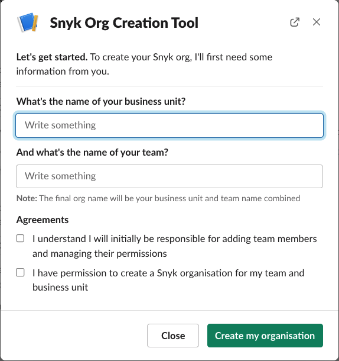
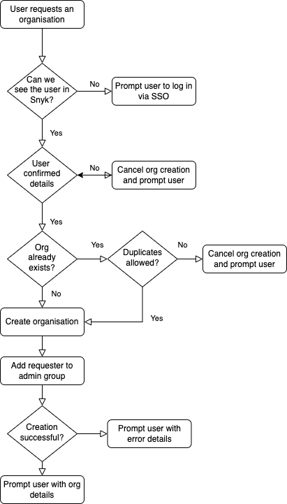

# Snyk - Self-service Org Creation Slack bot

A Slack bot which allows you to provide self-service Snyk organisation creation to your users. 

## What does this bot do?
This bot exposes commands to the Slack channels that you add it to. At the time of writing, the bot supports only a
single command (the name of which is user configured), which allows a user to request to create an organisation within Snyk. The bot will show a
dialog, asking the user for some input parameters; their business unit, their team name and it will also prompt them to
accept some internal terms of service.



Once the user tells the bot to create an organisation, a number of opinionated checks and balances takes place, namely:
* The bot will check if this org name already exists. If it exists and our settings do not allow duplicated names, we decline the request
  - In this case we'll also tell the user the existing admins of that org if they need to request to be added
* The bot prompts the user to first sign in to Snyk via their SSO method, this is to ensure users are created before provisioning
* The bot creates the organisation
* The requesting user is added as an `admin` of the newly created org
  - **Note:** The users email on Slack **must** match their email on Snyk for correct mapping to occur



## How do I use it?

### Pre-requisites
* First you'll need to create a Slack app following these [instructions](./docs/slack_app.md).
* You'll then need to configure your settings in the [settings.yaml](./docs/settings_yaml.md) file.

### Running locally / testing
```bash
pip install poetry
poetry update && poetry install
export SETTINGS_FILE_PATH="./settings.yaml"  # Replace with path to your settings
python main.py
```

### Running in a docker container
```bash
docker build . -t snyk-slack-bot  # Tag with your image name
docker run -v $(pwd)/settings.yaml:/opt/settings.yaml -e SETTINGS_FILE_PATH=/opt/settings.yaml -e SNYK_TOKEN=YOUR_SNYK_TOKEN -e SLACK_BOT_TOKEN=YOUR_BOT_TOKEN -e SLACK_APP_TOKEN=YOUR_APP_TOKEN snykbot
```

### Customizing
It's possible to change the chat messages and views to suit your liking. 
See [customization](./docs/customization.md) for details.
## Contributing
See [contributing.md](./.github/CONTRIBUTING.md).