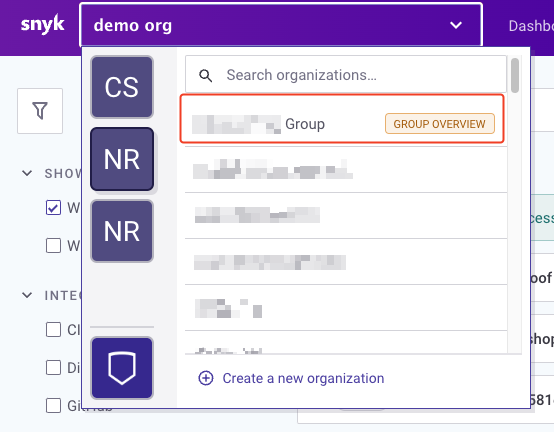
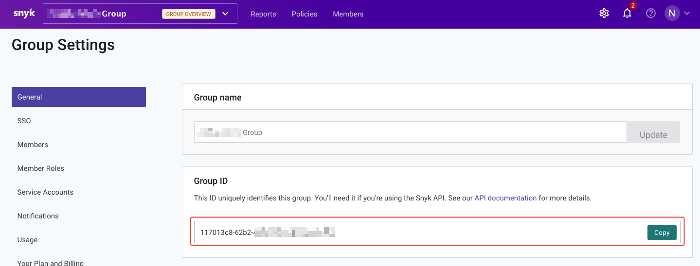

# Configuring bot settings
Please see `settings.yaml.example` for an example of settings. 

## Settings
| **Setting name**             | **Description**                                                                                                        | **Required?** |
|------------------------------|------------------------------------------------------------------------------------------------------------------------|---------------|
| slack_bot_token_env_var_name | The Slack bot token                                                                                                    | Yes           |
| slack_app_token_env_var_name | The Slack app token                                                                                                    | Yes           |
| snyk_token_env_var_name      | The environment variable name that we'll pull the snyk token from                                                      | Yes           |
| snyk_group_id                | The ID of the Snyk group where we'll create orgs                                                                       | Yes           |
| allow_duplicate_org_names    | If set to false this will not allow duplicate org names to be served by the bot                                        | Yes           |
| business_unit_regex_pattern  | The regex pattern that the business unit must follow                                                                   | Yes           |
| team_name_regex_pattern      | The regex pattern that the team name must follow                                                                       | Yes           |
| command_create_org           | The slash command to create an org (the same as the one you will have generated in the Slack app step - without the /) | Yes           |
| sso_sign_in_link             | The sign in link to your SSO provider - will prompt the user to log in via this link                                   | Yes           |
| sso_provider_name            | The name of your SSO provider                                                                                          | Yes           |

## Where to get your Snyk group ID
1. Log in to Snyk and select your group from the dropdown menu

2. Click the settings cog wheel (in the top right corner)
3. Under 'General' grab your group ID and use it for your settings.yaml file

## Regex patterns
For our business units and team names, the bot checks the user supplied values and compares them
against the regex we set in our settings files. Below are some sample patterns which may help.

| **Pattern** | **What it does**                              |
|----------|-----------------------------------------------|
| .*       | Will allow any input                          |
| (finance&#124;technology)                                    | Will only allow either 'finance' or 'technology' |
| company-.* | Will only allow inputs prefixed with 'company-' |