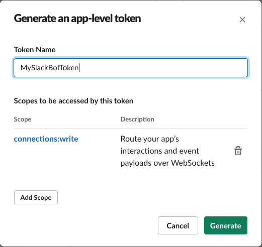
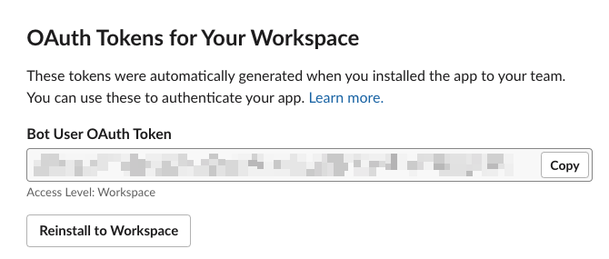
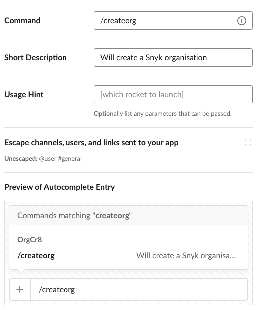

# Creating a Slack app
This guide walks through the process of setting up a Slack app. This will give our bot the necessary tokens and 
permissions for it to work correctly. 

## Create the app
1. Go to the [Slack apps dashboard](https://api.slack.com/apps) and click "Create New App"
2. Select "From scratch" when prompted
3. Give your app a name and select the workspace we'll install it to

## Enable socket mode
1. Under settings, select "Socket Mode"
2. Click the toggle to enable socket mode, Slack will prompt you to generate an app-level token
3. Give your token a sensible name
4. Click "Add Scope" and select `connections:write`
5. Click "Generate"
6. Copy your token and keep it somewhere safe - we'll need it later

## Permissions
1. Head to the "OAuth & Permissions" section
2. Under "Bot Token Scopes" add the following scopes
   1. channels:history
   2. chat:write
   3. commands
   4. groups:history
   5. groups:write
   6. im:history
   7. im:write
   8. mpim:history
   9. mpim:write
   10. users:read
   11. users:read.email
3. Back at the top of the page, click the "Install to Workspace" button and click allow on the prompt
4. You should now be presented with an OAuth token for your bot, copy this and keep it for later

## Creating slash commands
1. Go to the "Slash Commands" setting and click "Create New Command"
2. Decide the name of the slash command you would like (you'll configure this in settings later)
3. Click save
4. Repeat for difference commands (if applicable)

